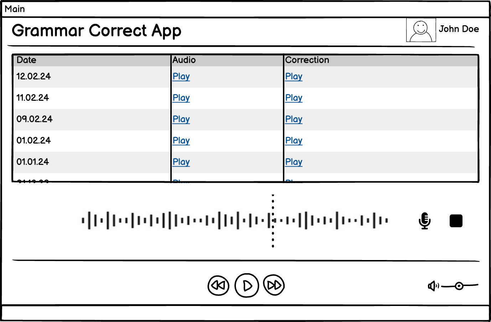

## Grammar Correct App

This is an app (user-facing) that provides an interface for the user to record an audio with replay
capabilities. The app corrects the mistakes of the audio (grammatical) through the backend service
and returns the corrected audio to the user, where it can be replayed.

The app is built using React as SPA (Single Page Application) due to React's popularity as an open-source
framework backed by large developer community with intuitive internals such as Virtual DOM and JSX making 
it a great choice for developers to adopt, whereas the component-based architecture of React 
encourages maintainability and extensibility. On the other hand, the Virtual DOM makes the app faster and more efficient by updating only the
changed parts of the DOM, which is a great advantage for the app to be responsive and interactive.

### Wireframe

### User Interface

The wireframe is a simple representation of the app's UI/UX design. 

The app is designed to be simple, intuitive and user-friendly. The app consists of a table to display the history of the user,
a record button, stop button and navigation bar on the audio player, whereas a control center with forward, backward, play button
and volume control are shown on the bottom of the app.

### User Interaction

The record button allows the user to record an audio, 
the replay button on the table allows the user to replay the audio or a corrected audio to listen 
to and the stop button allows the user to stop the recording or replaying of the audio. 
The user can also move the bar on the audio player to navigate through the audio or move 
the volume control to adjust the volume.

### Deployment (CI/CD)

The app is published on AWS S3 bucket and is deployed using CI/CD pipeline. 
The pipeline is triggered on every push with test stage and gives option 
to the developer to deploy the app to the S3 bucket through different environments for testing and production purposes.
Whereas, after the app is deployed, it is accessible through cloudfront distribution to provide low latency and high availability 
for the end users.

### Development

- use `npm install` to install the dependencies
- use `npm dev` to run the app in development mode