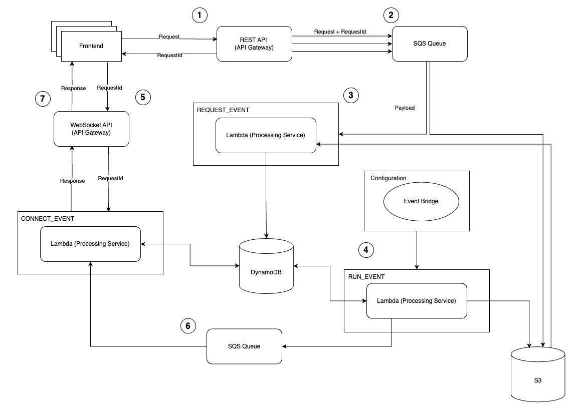

## Grammar Correct Service

The service receives an audio file for each user with their email address, stores it to the database and processes the
request
asynchronously. When the file is processed by the service, it shows user a notification on the frontend that the file is
ready to be played.

> _The infrastructure is based on AWS and the word service is used interchangeably to refer to this backend service that
processes the audio files._

### Design

The service is designed to be serverless and event-driven to handle the requests asynchronously.

Due to its event-driven nature, the service is **stable** and **performant** with the help of SQS for handling requests,
DynamoDB for storing the requests, and Lambda for processing the requests. It can handle high loads without overloading
any single component and
can scale automatically in response to incoming traffic.

Whereas the service is designed to be **scalable**, it is also designed to be **secure** and **reliable**.
The features from AWS such as data security on S3 and Dynamo controlled through
strict access policies, IAM roles for permissions management, and API Gateway security for endpoints are used to ensure
the security
of the service.

The service is also **maintainable** and
**extendable** with the help of modular components such as Event Bridge for triggering events and API Gateway for REST
and WebSocket API endpoints
to extend the service with new endpoints. Also, the loosely coupled components such as Lambda functions and SQS queue
allow for easier maintenance.

#### Technologies to be used in the service:

1. SQS for the queue
2. S3 for file storage
3. DynamoDB for the database
4. Lambda as a service
5. Eventbridge as a scheduler
6. API Gateway for restful API endpoints
7. API Gateway for websocket protocol

### Technical Flow

1. The API Gateway is connected to SQS, receives a request from the client and responds with a request id.
2. The request with payload and request id is sent to the SQS queue.
3. The service receives an event [REQUEST_EVENT](#request_event) triggered from SQS and performs:
    - storage of the audio file in S3
    - storage of request details in DynamoDB
4. Eventbridge after every few minutes triggers the service that processes the `NEW` (status) files and performs:
    - processing of the audio file
    - updates the request status in DynamoDB
    - stores the processed file in S3
5. The client opens a websocket connection by the request id (performs [CONNECT_EVENT](#connect_event-)) and listens for
   the incoming notifications.
6. After each [RUN_EVENT](#run_event-) the service sends a notification on the queue with the runId.
7. The service search on Dynamo for the requests being fulfilled and updates the clients connected to the websocket.

#### unhappy path

The service can handle the unhappy path by retrying the failed requests and storing the failed requests in the database,
also the service will retry the failed requests after a certain period of time through Dead Letter Queue and EventBridge.



### Table Schema

The table schema defines the structure of the data stored in the DynamoDB table. The table is designed
to take benefit of noSQL features such as schema flexibility. The table schema combines
that flexibility with the ability to store the data and combines it for `RUN_EVENT` and
`REQUEST_EVENT` events respectively.

#### Partition Key

The partition key is used to distribute the data across partitions. In this case, the email of the user is used as the
partition key to store the requests of the user in the same partition which makes it easier to retrieve the requests
of the user.

#### Sort Key

The sort key is used to sort the items with the same partition key. In this case, the requestId of the request is used
as the sort key to
sort the requests of the user, which makes each request unique and easy to retrieve.

### Attributes for the requests

| Field Name        | Type   | Description                            |
|-------------------|--------|----------------------------------------|
| partitionKey      | String | The email of the user                  |                  
| sortKey           | String | The requestId of the request           |
| email             | String | The email of the user                  |
| requestId         | String | The requestId of the request           |
| status            | String | The status of the request              |
| filename          | String | The filename of the audio file         |
| requestsProcessed | Number | The number of requests processed       |
| requestsFound     | Number | The number of requests found           |
| requestsFailed    | Number | The number of requests failed          |
| duration          | Number | The duration of the request processing |

### Attributes for the run events

| Field Name        | Type   | Description                            |
|-------------------|--------|----------------------------------------|
| partitionKey      | String | `RUN#{uuid}`                           |                  
| sortKey           | String | `{uuid}`                               |
| requestsProcessed | Number | The number of requests processed       |
| requestsFound     | Number | The number of requests found           |
| requestsFailed    | Number | The number of requests failed          |
| duration          | Number | The duration of the request processing |

### Example

| partitionKey                             | sortKey                              | email              | requestId                            | status    | filename  | requestsProcessed | requestsFound | requestsFailed | duration |
|------------------------------------------|--------------------------------------|--------------------|--------------------------------------|-----------|-----------|-------------------|---------------|----------------|----------|
| john.doe@email.com                       | 27181f8f-baea-4785-98a5-6d5153ada634 | john.doe@email.com | 27181f8f-baea-4785-98a5-6d5153ada634 | PROCESSED | audio.mp3 |                   |               |                |          |
| RUN#60df8f77-108f-40f3-9c75-7db44faea78d | 60df8f77-108f-40f3-9c75-7db44faea78d |                    |                                      |           |           | 1                 | 1             | 0              | 1000     |

### Requests Type and Structure

Basic structure of the request is as follows:

```json
{
  "email": "john.doe@email.com",
  "data": "base64 encoded audio file",
  "requestId": "27181f8f-baea-4785-98a5-6d5153ada634"
}
```

### Events

#### REQUEST_EVENT

> This event is triggered when a user uploads the file

`Records array containing the message with our request`

```json
{
  "Records": []
}
```

#### RUN_EVENT

> This event is triggered by event bridge to process the files

```json
{
  "type": "RUN_EVENT",
  "state": "NEW"
}
```

#### CONNECT_EVENT

> This event is triggered by event bridge to process the files

```http request
wss://api-id.execute-api.region.amazonaws.com/production?requestId=27181f8f-baea-4785-98a5-6d5153ada634
```

#### DIRECT_INVOCATION

> This event is used for testing purposes

```json
{
  "type": "DIRECT_INVOCATION",
  "email": "john.doe@email.com",
  "data": "base64 encoded audio file"
}
```

### Response

The response is sent to the client after the request is processed. The response contains the corrected audio, requestId
and the status of the request.

```json
{
  "requestId": "27181f8f-baea-4785-98a5-6d5153ada634",
  "status": "PROCESSED",
  "data": "base64 encoded audio file"
}
```

### References

- [AWS Documentation](https://docs.aws.amazon.com/)
- [Drawing Tool](https://app.diagrams.net/)
- [Websocket API](https://docs.aws.amazon.com/apigateway/latest/developerguide/apigateway-websocket-api.html)
- [AWS Javascript SDK](https://docs.aws.amazon.com/sdk-for-javascript/v3/developer-guide/welcome.html)
- [AWS Blog on API Gateway](https://aws.amazon.com/blogs/compute/from-poll-to-push-transform-apis-using-amazon-api-gateway-rest-apis-and-websockets/)
- [API Sync/Async Model](https://aws.amazon.com/blogs/compute/managing-backend-requests-and-frontend-notifications-in-serverless-web-apps/)

### Development

- use `npm install` to install the dependencies
- use `npm test` to run the tests